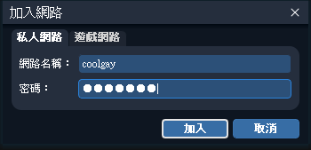

:::tip
1. 安裝 [Radmin VPN](https://www.radmin-vpn.com/tw/)  
2. 加入 Radmin VPN 區域網路 帳號和密碼皆為 coolgay  
  
  
3. 打開 ARK 點選加入線上方舟  
  
4. 左下角篩選伺服器選擇局域網  
  
5. 按下刷新後加入伺服器  
如果顯示連線遇時請多等一下  
通常載入模組需要幾分鐘的時間

如果有其他問題請私訊 Discord Young#8204
:::