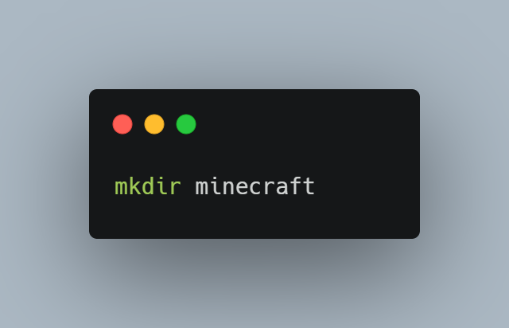
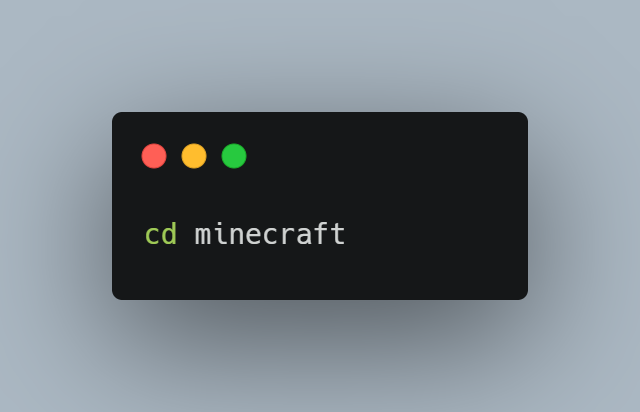
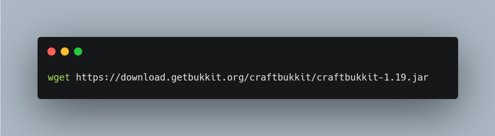
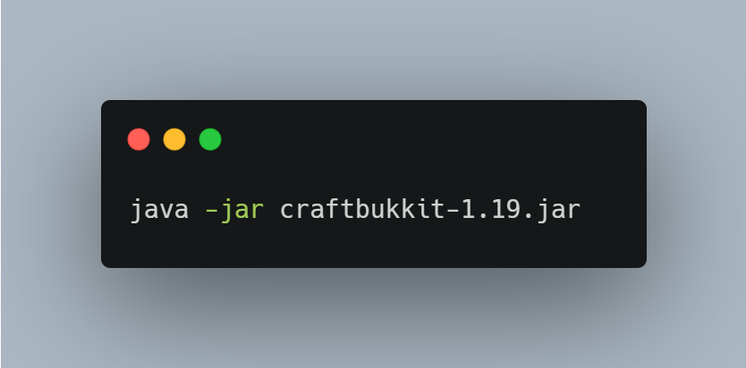
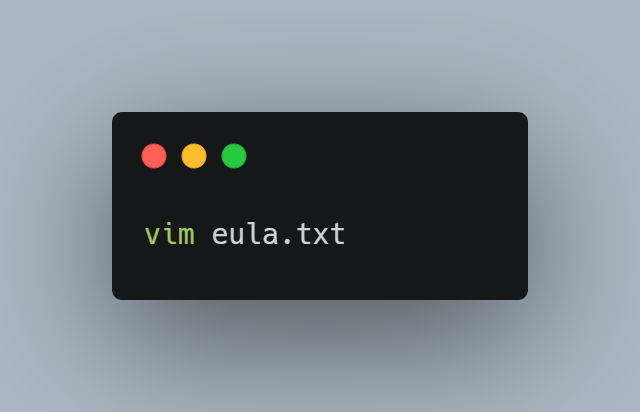
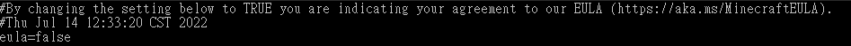

:::tip
Minecraft 做為一款在我這個時代大家小時候都愛玩的遊戲肯定也有不少人想自己架設伺服器卻不知道從何開始，
這次我會用 Ubuntu 22.04 LTS 的 Server 版來架設 CraftBukkit 伺服器。  

同時為了支援 24 小時上線所以不建議拿主力機來架設(除非只有一台電腦能用)。  

# 先備條件  

- 一台電腦(建議安裝 Ubuntu 以便後續跟著內文實作)  
- 穩定的電力與網路  
- 稍微接觸並使用過終端機(建議)  
- 熟悉基礎檔案管理(建議)  

# 開始架設  

### 建立並進入 Minecraft 資料夾  

### [下載 CraftBukkit 的 jar 檔案](https://getbukkit.org/)  

### 運行 jar 檔案  

### 編輯 eula.txt

按下 a 進入編輯模式後操控方向鍵把 false 替換成 true  
修改好按下 esc 接著輸入 :wq 後按 enter 退出 vim  

### 啟動伺服器

### Java 版本問題  

到這邊如果 Java 沒有報錯的話就是安裝完成了，如果有報錯的話通常是因為 Java 版本過舊。  

[How to Install Java JDK 17 on Ubuntu 22.04](https://www.itzgeek.com/how-tos/linux/ubuntu-how-tos/install-java-jdk-17-on-ubuntu-22-04.html)

# 後續  

其實上面這些做完後還需要做以下的事情才能讓伺服器功能更完善，之後可能會再增加其他教學。  

- 將伺服器的 port 25565 轉向外網 (讓其他人連線)  
- 設定 dns  
- 插件 (DiscordSRV, Residence)  
:::